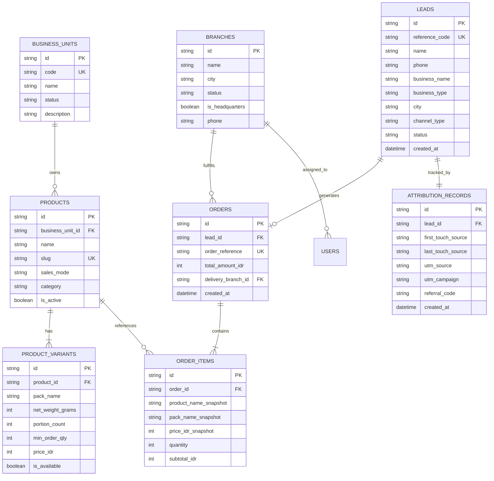

# ENTITY-RELATIONSHIP DIAGRAM (ERD) — HATOBA GROUP

```mermaid
erDiagram
    BUSINESS_UNITS ||--o{ PRODUCTS : owns
    PRODUCTS ||--|{ PRODUCT_VARIANTS : has
    BRANCHES ||--o{ ORDERS : fulfills
    BRANCHES ||--o{ USERS : assigned_to

    LEADS ||--o| ORDERS : generates
    LEADS ||--|| ATTRIBUTION_RECORDS : tracked_by
    ORDERS ||--|{ ORDER_ITEMS : contains
    PRODUCTS ||--o{ ORDER_ITEMS : references

    BUSINESS_UNITS {
        string id PK
        string code UK
        string name
        string status
        string description
    }

    BRANCHES {
        string id PK
        string name
        string city
        string status
        boolean is_headquarters
        string phone
    }

    PRODUCTS {
        string id PK
        string business_unit_id FK
        string name
        string slug UK
        string sales_mode
        string category
        boolean is_active
    }

    PRODUCT_VARIANTS {
        string id PK
        string product_id FK
        string pack_name
        int net_weight_grams
        int portion_count
        int min_order_qty
        int price_idr
        boolean is_available
    }

    LEADS {
        string id PK
        string reference_code UK
        string name
        string phone
        string business_name
        string business_type
        string city
        string channel_type
        string status
        datetime created_at
    }

    ORDERS {
        string id PK
        string lead_id FK
        string order_reference UK
        int total_amount_idr
        string delivery_branch_id FK
        datetime created_at
    }

    ORDER_ITEMS {
        string id PK
        string order_id FK
        string product_name_snapshot
        string pack_name_snapshot
        int price_idr_snapshot
        int quantity
        int subtotal_idr
    }

    ATTRIBUTION_RECORDS {
        string id PK
        string lead_id FK
        string first_touch_source
        string last_touch_source
        string utm_source
        string utm_campaign
        string referral_code
        datetime created_at
    }
```

